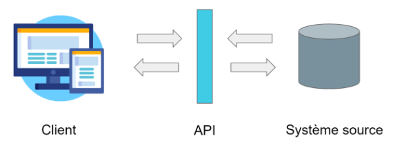

# Introduction sur les APIs

::: details Sommaire
[[toc]]
:::

## Les APIs en général
Quiconque exerce un métier dans l'IT, a déjà plus ou moins entendu parler d'API. Mais de quoi s'agit-il exactement ?

Une API (Application Programming Interface) est une interface qui va permettre d'échanger des données et/ou des fonctionnalités entre des clients et un système d'information.

Bon, voici un schéma pour imager tout ça 😅

Le client peut être une une application web, desktop, ou mobile. Et le système peut etre un serveur, des bases de données, ou une application.

 

Une API permet donc :
* De centraliser les données échangées, et ainsi de sécuriser les accès des différents clients
* De conserver une traces des différentes requêtes (des logs)
* De facilement pouvoir intéragir avec un système sans se soucier de son fonctionnement
* Et en plus elles sont intuitives 😉

## API REST
