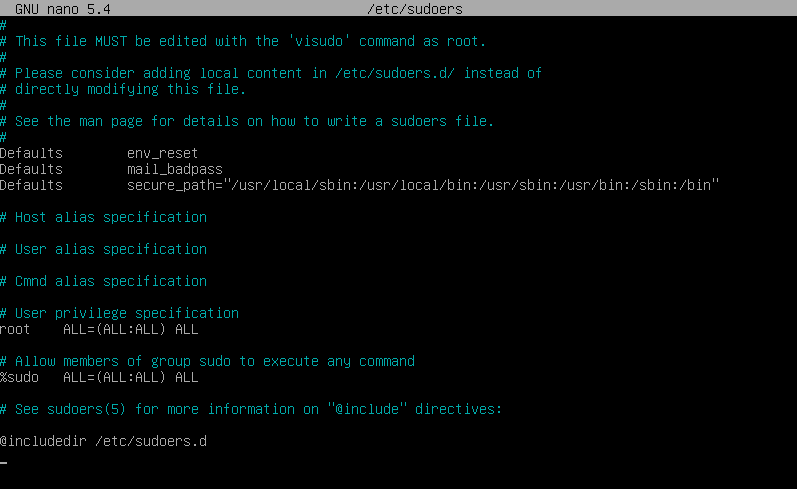
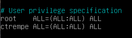
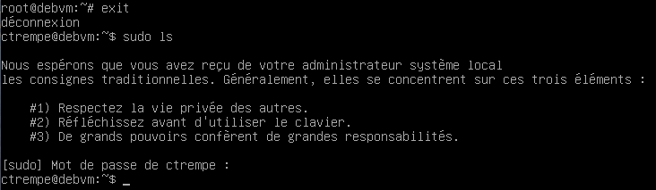

# Configurer les sudoers (commande sudo)

La commande `sudo` permet à un utilisateur d'exécuter une commande en tant que 'root' (super utilisateur).

Elle est installée par défaut sur certaines distributions, comme Ubuntu, mais parfois cela ne peut pas être forcément le cas, comme Debian par exemple.

## Installation de sudo
Commençons par passer en root pour installer sudo :
```sh
$ su -
```
Maintenant, installons sudo :
```
# apt-get install sudo
```

<br>

Sudo est maintenant installé sur notre machine !

## Editer le fichier de configuration de sudo
Le fichier de configuration de sudo se trouve ici `/etc/sudoers`. Ouvrons-le avec un éditeur de texte :

_Avec Nano :_
```
# nano /etc/sudoers
```

_Avec Vim :_
```
# vi /etc/sudoers
```

<br>

Nous découvrons maintenant le contenu de notre fichier 😯 :




Rassurez-vous, ça a l'air un peu complexe, mais au premier abord c'est plutôt simple 😉


## Ajouter un utilisateur dans les sudoers
Prenons l'exemple avec l'utilisateur `ctrempe` an ajoutant cette ligne dans notre configuration :
```
ctrempe ALL=(ALL:ALL) ALL
```

Et voilà ! Notre configuration doit maintenant ressembler à ceci :





::: tip
Après avoir fermé l'éditeur de texte, pas besoin de recharger la configuration de sudo !
Les permissions sont immédiatement appliquées sur notre utilisateur :



:::


## Ajouter un groupe dans les sudoers

L'ajout d'un groupe dans les sudoers ne change pas quasiment pas par rapport à celle d'un utilisateur. En effet la ligne est la même, il faut simplement rajouter un `%` en préfixe.

Exemple avec le groupe `admin`, il suffit d'ajouter cette ligne :

```
%admin  ALL=(ALL:ALL) ALL
```

Ce qui nous donne :


Et oui, c'est aussi simple que ça 👌

::: tip
Comme vous pouvez le voir, le fichier de configuration contient une permission par défaut pour le groupe `sudo`. Si vous souhaitez l'utiliser, vous avez simplement besoin d'ajouter les utilisateurs concernés dans ce groupe :

```
# adduser ctrempe sudo
```
:::

# Retirer la saisie d'un mot de passe

Il est possible de suspendre la demande d'un mot de passe sur une commande spécifique et pour un utilisateur choisi.

Allons-y dans le concrès : admettons j'ai sur ma machine un utilisateur `cron` qui redémarre automatiquement mon serveur Apache à 5h du matin avec la commande `sudo systemctl restart apache2`. La commande risque de ne pas passer car le mot de passe de l'utilisateur sera demandé.

Pour cela, nous allons préciser dans la configuration de sudo que l'utilisateur `cron` est seulement autorisé à exécuter cette commande (en tant que "sudo") et sans besoin de demander le mot de passe.

Pour cela, nous devons ajouter cette ligne dans notre fichier de configuration :

```
cron ALL=NOPASSWD: /bin/systemctl restart apache2
```

::: tip
Nous pouvons ajouter plusieurs commandes, pour cela il suffit de les séparer par une virgule (**,**)
:::