# Introduction et installation de Jenkins

::: tip Table des matières
[[toc]]
:::

## Introduction


### Qu'est-ce que Jenkins ?
Jenkins est un outil d'intégration continue et de déploiement continu (CI/CD) développé en Java. Il peut être installé sur une instance Docker et sur tout système disposant d'un JRE (Java Runtime Environment). Un point fort de l'outil : son grand nombre de plugins permettant d'intéragir avec une variété de technologies.

### L'intégration continue (CI) et le déploiement continu (CD)
"L'inté quoi ??"<br>
L'intégration continue est un processus qui va permettre d'automatiser différents tests sur notre application afin de s'assurer que les modifications apportées dans le code source ne génèrent aucune erreur. En cas de problème lors de cette phase de test, la chaîne de vérification s'arrête et le serveur d'intégration informe les développeurs de l'incident.

Si la série de test est passée avec succès, l'application va être compilée et livrée automatiquement en production, c'est le déploiement continu (CD).

<br>

Pour résumer, l'intégration continue permet donc de :
- Renforcer la productivité de l'équipe de développement
- Trouver plus rapidement les bugs
- Livrer plus rapidement les nouvelles versions de l'application

<br>

> La documentation de Jenkins est disponible [ici](https://www.jenkins.io/doc/)

<br>

## Installation de Jenkins
### Installation des prérequis
Dans un premier temps, il faut installer Java sur notre machine

:::warning Attention
Jenkins est compatible jusqu'à Java 17 !
:::

<br>

Pas de problème, installons Java 17 😎
```sh
sudo apt-get install openjdk-17-jre
```

<br>

Maintenant installons curl, nécessaire à l'installation de Jenkins
```sh
sudo apt-get install curl
```

<br>

### Installation de Jenkins
Parfait, maintenant nous pouvons installer Jenkins
:::tip
Les commandes peuvent différer avec les versions récentes de Jenkins. Les commandes d'installation actuelles sont disponibles [ici](https://www.jenkins.io/doc/book/installing/linux/#debianubuntu)
:::

<br>

:::warning Une erreur apparaît lors de l'installation ?
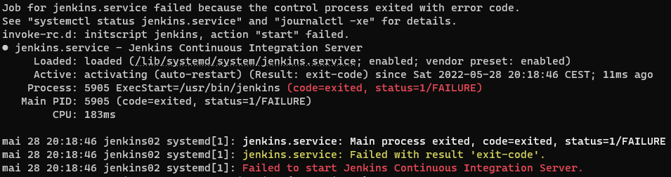
Pas de panique, c'est "normal" 😉<br>
Tout est bien installé ! Seulement, Jenkins essaie de se démarrer avec une version de Java installée sur le système qui n'est pas prise en charge..
:::

<br>

Pour résoudre ce problème, il faut préciser dans le fichier de configuration de Jenkins, le chemin d'accès à la version de Java avec laquelle il doit démarrer.<br>
Cette ligne est déjà là, mais commentée
```sh
sudo nano /usr/lib/systemd/system/jenkins.service
```

<br>

::: tip
Utilisez la fonction de recherche de Nano : `CTRL + W`<br>
Puis saisissez `JAVA_HOME` et appuyez sur Entrée
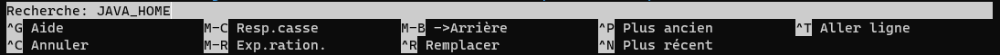
:::

<br>

Une fois la ligne trouvée, décommentée là et enregistrez les modifications
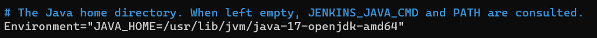

<br>

::: tip
C'est également dans ce fichier de configuration que nous allons pourvoir configurer le port sur lequel Jenkins va fonctionner.<br>
Par défaut, Jenkins se lance sur le port `8080`
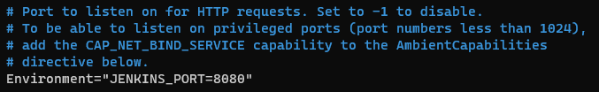
:::

<br>

A présent, nous allons recharger le fichier de configuration du service
```sh
sudo systemctl daemon-reload
```

<br>

Et nous relançons Jenkins
```sh
sudo systemctl restart jenkins
```

<br>

### Premier démarrage de Jenkins

Rendez-vous maintenant sur le navigateur ! Nous arrivons sur la page de démarrage de Jenkins

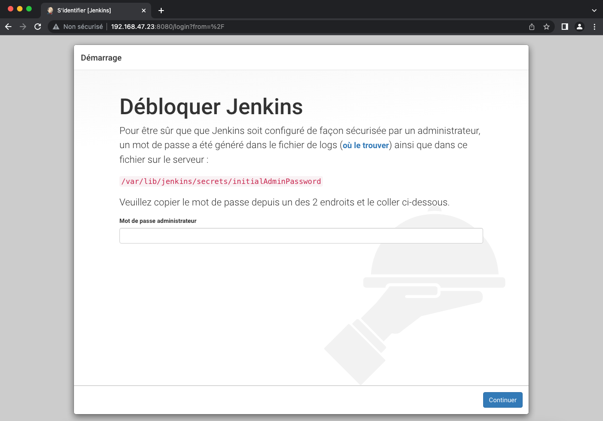

<br>

Comme indiqué, commençons par récupérer le mot de passe administrateur généré pour le copier/coller dans le navigateur
```sh
sudo cat /var/lib/jenkins/secrets/initialAdminPassword
```
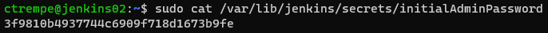

<br>

Ensuite nous choisissons d'installer les plugins recommandés
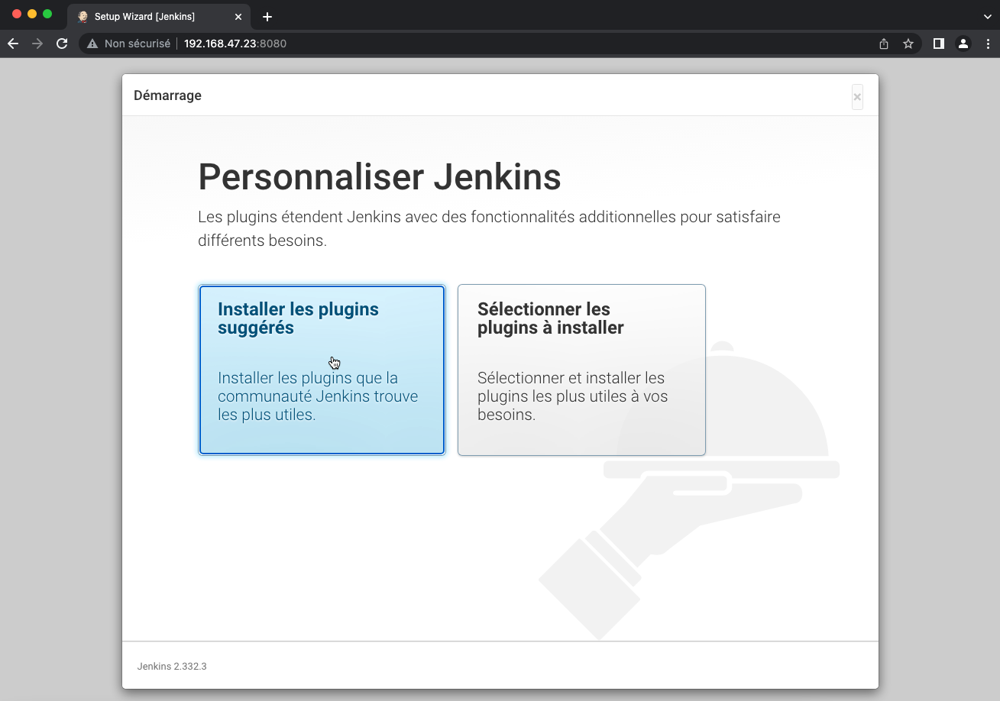

<br>

Jenkins va à présent installer les différents plugins suggérés, il suffit de patienter..


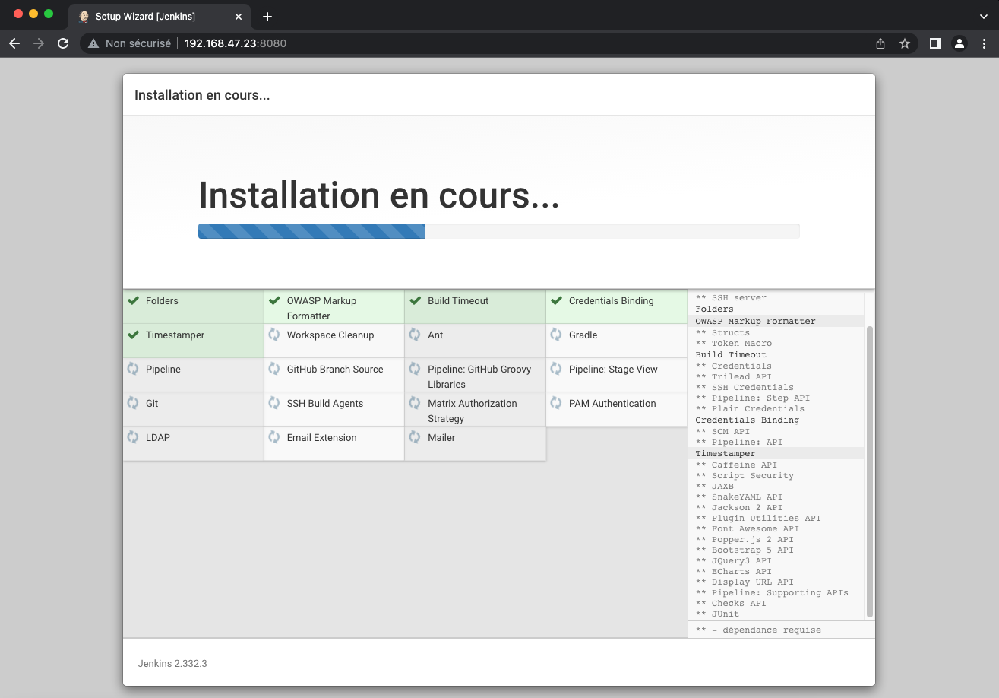

<br>

Création du premier compte administrateur


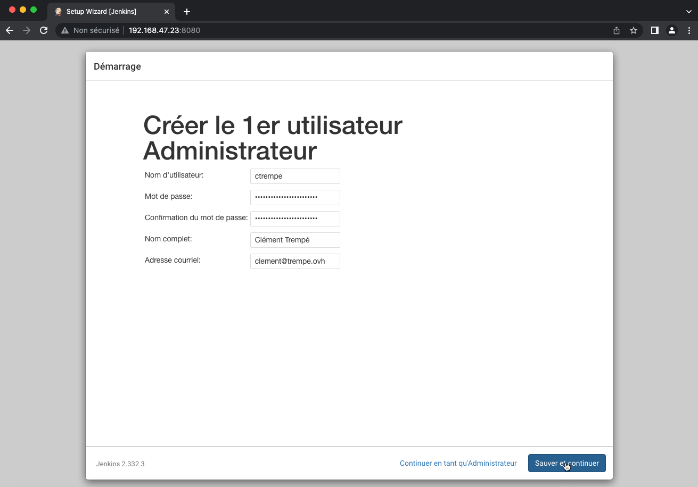

<br>

Configurons à présent l'URL avec laquelle les utilisateurs utiliserons Jenkins. 


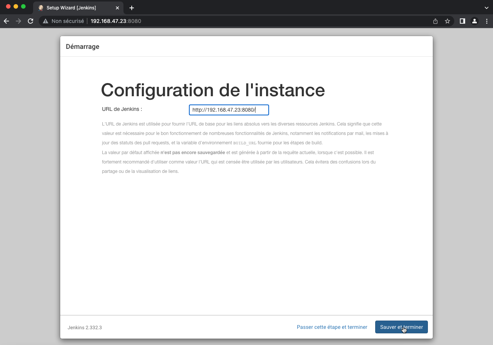

<br>

La configuration de Jenkins est enfin terminée !

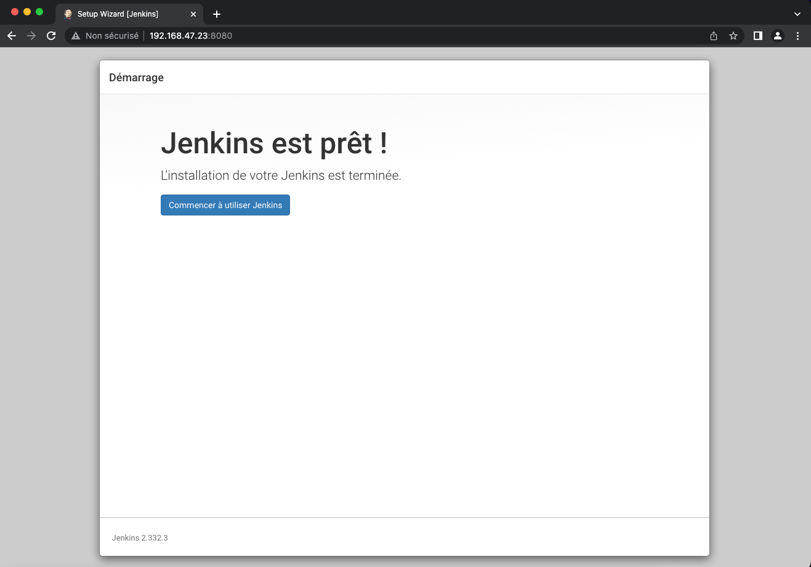

<br>

Jenkins est maintenant installé sur notre machine. C'est ici que tout commence à présent ! 😎

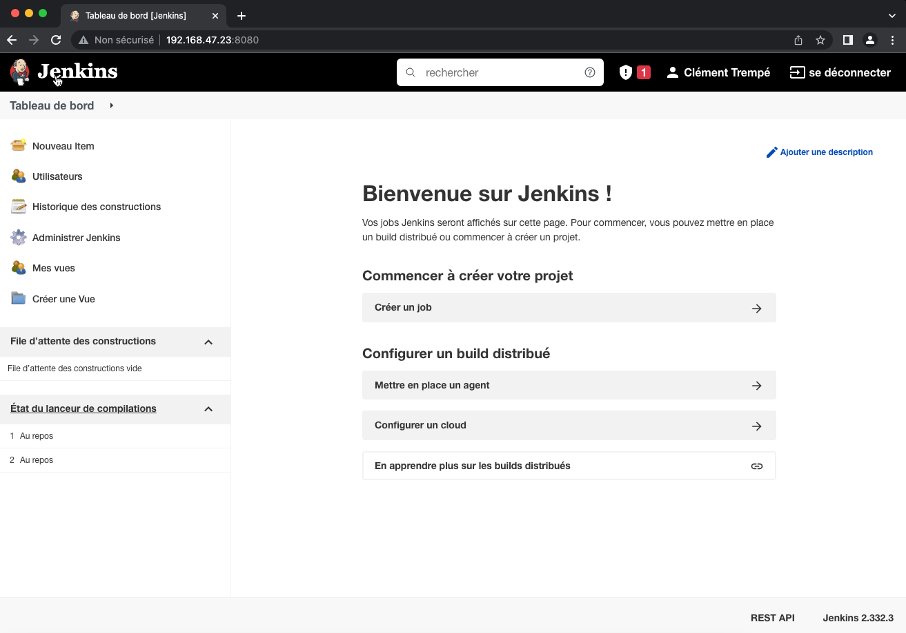