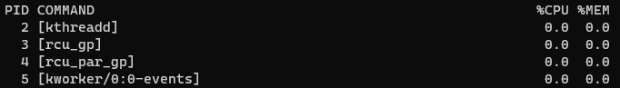

# Gérer les processus

Dans l'exemple ci-dessous, nous allons identifier et arrêter de force un processus.

## Afficher la liste des processus
Dans un premier temps, nous allons afficher la liste des processus en cours d'exécution sur notre machine afin d'identifier celui qui nous intéresse :

```sh
# Classé par utilisation du CPU
ps -eo pid,args:60,pcpu,pmem --sort pcpu

# Classé par utilisation de la RAM
ps -eo pid,args:60,pcpu,pmem --sort pmem
```

<br>

L'affichage est classé sous forme de tableau à 4 colonnes [ID, Processus, %CPU, %RAM] :



Dans cet exemple, le process `AskHimAPI` utilise environ 17,1% de la RAM de la machine.

::: tip A savoir
Les valeurs retournées ici ne sont que des approximations
:::

<br>

Après avoir identifié le processus que nous souhaitons arrêter, nous allons retenir son ID (première colonne).

## Afficher les informations d'un processus
On affiche les détails du processus choisi :
```sh
sudo systemctl status <ID_du_processus>
```


## Arrêter un processus
Et maintenant, on kill le processus :
```sh
sudo kill -9 <ID_du_processus>

# Exemple
sudo kill -9 663
```
Et voilà ! 😎