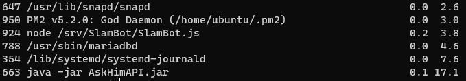

# Gérer les processus

Il arrive parfois qu'un processus ne répond plus, ou que le serveur soit saturé par manque de ressource.
Dans ce cas là, nous souhaitons arrêter de force un processus.

## Afficher la liste des processus
Dans un premier temps, nous allons afficher la liste des processus en cours d'exécution sur notre machine.

Afficher la liste des processus :
```sh
# Classé par utilisation du CPU
ps -eo pid,args:60,pcpu,pmem --sort pcpu

# Classé par utilisation de la RAM
ps -eo pid,args:60,pcpu,pmem --sort pmem
```

L'affichage ressemble à ceci [ID, Processus, %CPU, %RAM] :



Dans cet exemple, le process `AskHimAPI` utilise environ 13,5% de la RAM de la machine.

Après avoir identifié le processus que nous souhaitons arrêter, nous allons retenir son ID (première colonne).

## Arrêter un processus
Pour arrêter le processus, il suffit d'exécuter la commande suivante :
```sh
sudo kill -9 <ID_du_processus>

# Exemple
sudo kill -9 662
```
Et voilà ! 😎