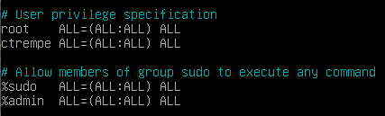

# Configurer les sudoers (sudo)

La commande `sudo` permet à un utilisateur d'exécuter une commande en tant que 'root' (super utilisateur).

Elle est installée par défaut sur certaines distributions comme Ubuntu, mais parfois ce n'est pas forcément le cas comme sur Debian.

## Installation de sudo
Tout d'abord, commençons par passer en root :
```sh
su -
```

<br>

Maintenant, installons sudo :
```sh
# En root
apt-get install sudo
```

<br>

Sudo est maintenant installé sur notre machine !

## Editer le fichier de configuration de sudo
Le chemin d'accès du fichier de configuration de sudo se trouve dans `/etc/sudoers`. Ouvrons-le avec un éditeur de texte :

```sh
# Avec Nano :
nano /etc/sudoers

# Avec Vim :
vi /etc/sudoers
```


## Ajouter un utilisateur dans les sudoers
Notre objectif est maintenant de donner les permissions sudoers à l'utilisateur `ctrempe`.

Pour cela, ajoutons cette ligne dans le fichier de configuration :
```
ctrempe ALL=(ALL:ALL) ALL
```

<br>

Notre configuration doit maintenant ressembler à ceci :


::: tip
Après avoir fermé l'éditeur de texte, les permissions sont immédiatement appliquées sur notre utilisateur. Un message de prévention apparaît lors de la première commande exécutée en sudo :


:::

<br>

Et voilà, nous venons d'ajouter l'utilisateur `ctrempe` dans les sudoers 😄


## Ajouter un groupe dans les sudoers
Pour faciliter la gestion des permissions, nous pouvons accorder une autorisation pour l'ensemble des utilisateurs d'un groupe.

La ligne reste la même que pour les utilisateurs, il faut simplement rajouter un `%` en préfixe pour préciser qu'il s'agit d'un groupe.

Exemple avec le groupe `admin` :

```
%admin  ALL=(ALL:ALL) ALL
```

Ce qui nous donne :



Et oui, c'est aussi simple que ça 👌

::: tip
Comme vous pouvez le voir, une permission est accordée par défaut pour le groupe `sudo`. Si vous souhaitez l'utiliser, vous devez simplement ajouter les utilisateurs concernés dans ce groupe :

```sh
# En root, dans /root
adduser ctrempe sudo
```
:::

# Retirer la demande du mot de passe de l'utilisateur

::: danger Alors là, attention attention !!
Nous sommes d'accord sur le fait que cette pratique est dangereuse en terme de sécurité.
<br>
Privilégiez cette solution uniquement lorsque la commande est exécutée par un programme. Et assurez-vous de créer un utilisateur sur votre machine spécifiquement pour ce service.
:::

Et oui, il est possible de faire en sorte que le système ne demande pas le mot de passe de l'utilisateur lors de l'exécution d'une commande en sudo.

Allons-y dans le concrès avec un exemple : admettons que j'ai sur ma machine un utilisateur `rebootauto` qui redémarre automatiquement mon serveur Apache à 5h du matin avec la commande `sudo systemctl restart apache2`.
<br>
Dans un premier temps, la commande risque de ne pas passer car le mot de passe de l'utilisateur nous sera demandé 😔

Pour cela, nous allons préciser dans la configuration que l'utilisateur `rebootauto` est seulement autorisé à exécuter cette commande sans demander le mot de passe.

<br>

Il suffit de préciser ces paramètres dans le fichier de configuration :

```
rebootauto ALL=NOPASSWD: /bin/systemctl restart apache2
```

::: tip
Nous pouvons ajouter plusieurs commandes, pour cela il suffit de les séparer par une virgule (**,**)
<br>
Exemple :

```
rebootauto ALL=NOPASSWD: /bin/systemctl restart apache2, /bin/systemctl restart mysql
```
:::