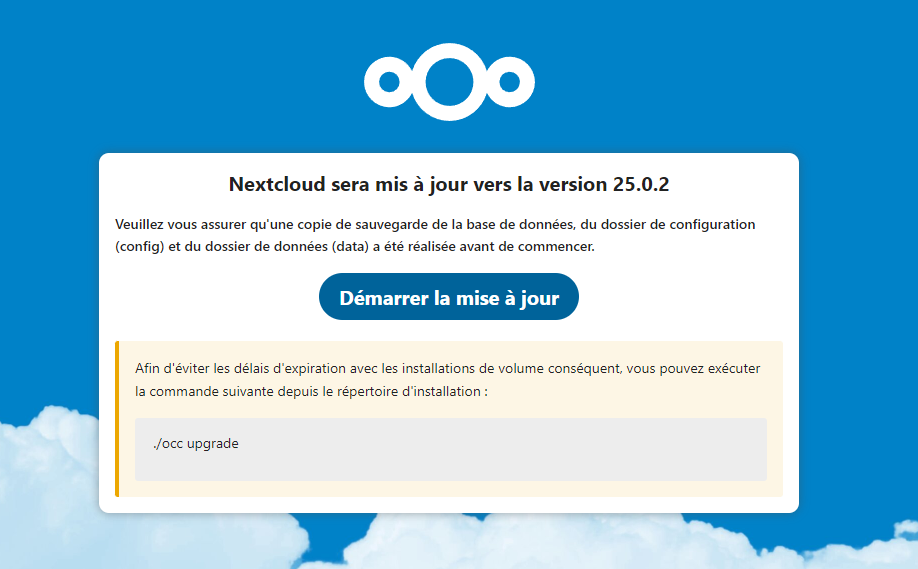

# Mettre à jour Nextcloud

## Introduction

Nextcloud est une solution open source de stockage et de partage de fichiers. Auto-hébergé, elle permet de créer son propre cloud privé et possède également des applications clients disponibles sur ordinateurs et mobiles.

> En savoir plus sur [Nextcloud](https://nextcloud.com/fr/)

## Mise à jour de Nextcloud

Tout d'abord, téléchargez la dernière version de Nextcloud
```sh
wget https://download.nextcloud.com/server/releases/latest.tar.bz2
```

<br>

Ensuite, décompressez l'archive téléchargée
```sh
tar -xf latest.tar.bz2
```

<br>

Et copiez les nouveaux fichiers vers notre serveur Nextcloud
```sh
rsync -a nextcloud/ /chemin/vers/votre/nextcloud/
```

<br>

A présent, en retournant sur votre Nextcloud, vous serez invité à mettre à jour votre serveur 😉
